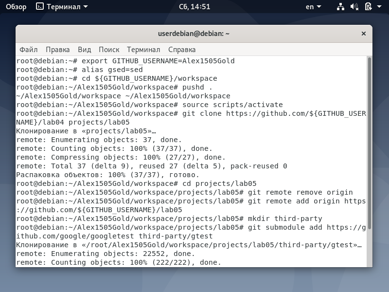
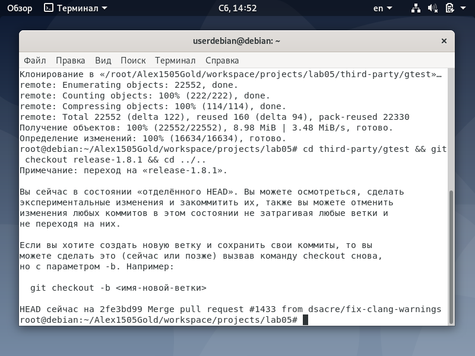
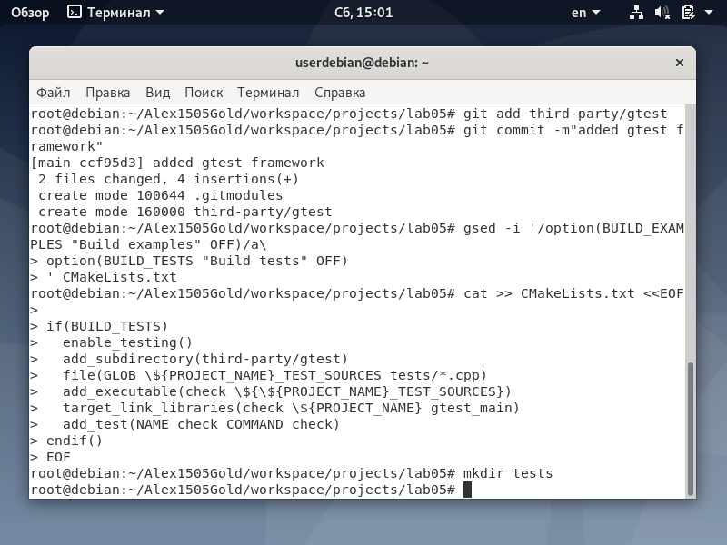
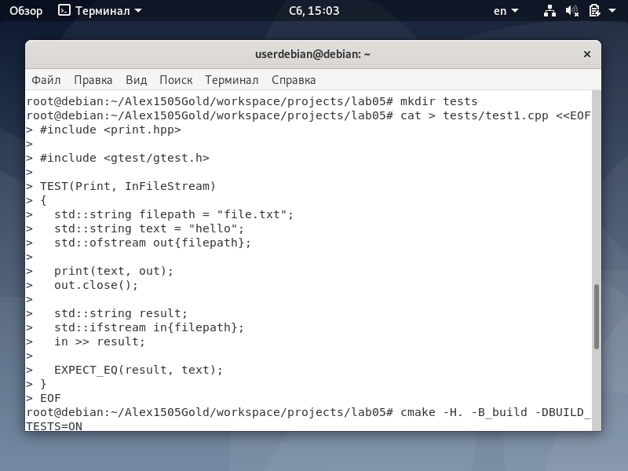
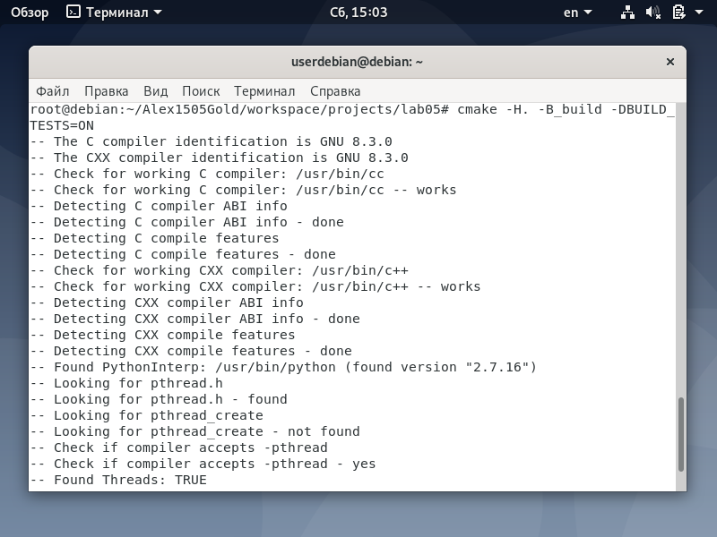
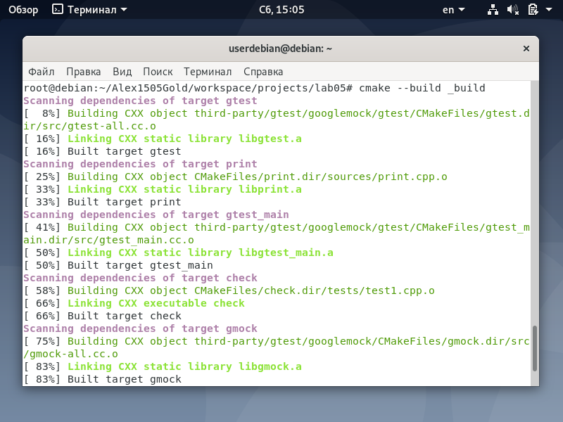
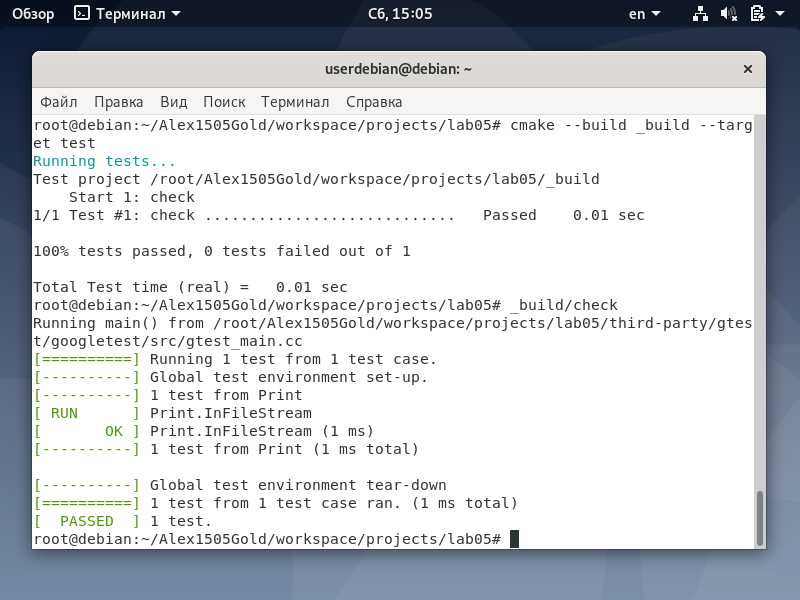
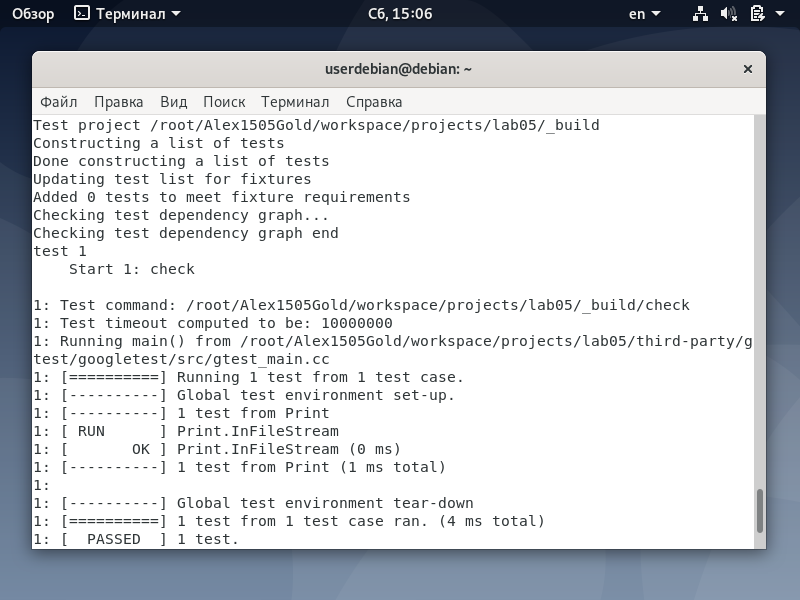
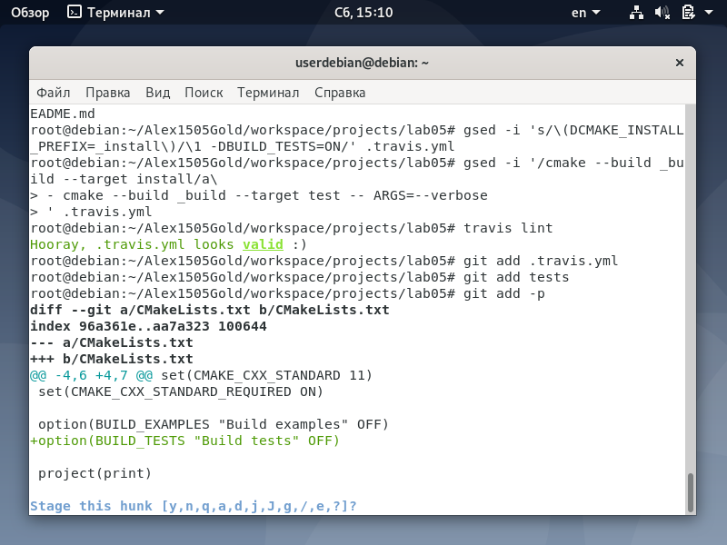
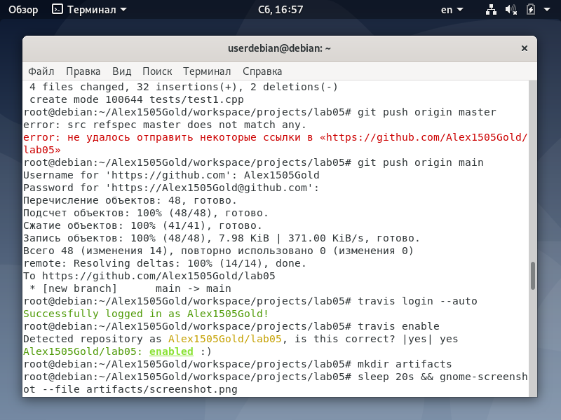

<h1>Отчет по лобораторной 05</h1>
</br>gmail почта - sgolenkov2002@gmail.com </br>
telegram - @Xacker_ducker

<h2>Ход выполнения лабораторной работы:</h2>

[репозиторий lab05](https://github.com/Alex1505Gold/lab05)</br>
Были выплнены следующие команды
```shell
export GITHUB_USERNAME=Alex1505Gold
alias gsed=sed # for *-nix system
cd ${GITHUB_USERNAME}/workspace
pushd .
source scripts/activate
git clone https://github.com/${GITHUB_USERNAME}/lab04 projects/lab05
cd projects/lab05
git remote remove origin
git remote add origin https://github.com/${GITHUB_USERNAME}/lab05
mkdir third-party
git submodule add https://github.com/google/googletest third-party/gtest
cd third-party/gtest && git checkout release-1.8.1 && cd ../..
git add third-party/gtest
git commit -m"added gtest framework"
gsed -i '/option(BUILD_EXAMPLES "Build examples" OFF)/a\
option(BUILD_TESTS "Build tests" OFF)
' CMakeLists.txt
cat >> CMakeLists.txt <<EOF

if(BUILD_TESTS)
  enable_testing()
  add_subdirectory(third-party/gtest)
  file(GLOB \${PROJECT_NAME}_TEST_SOURCES tests/*.cpp)
  add_executable(check \${\${PROJECT_NAME}_TEST_SOURCES})
  target_link_libraries(check \${PROJECT_NAME} gtest_main)
  add_test(NAME check COMMAND check)
endif()
EOF
mkdir tests
cat > tests/test1.cpp <<EOF
#include <print.hpp>

#include <gtest/gtest.h>

TEST(Print, InFileStream)
{
  std::string filepath = "file.txt";
  std::string text = "hello";
  std::ofstream out{filepath};

  print(text, out);
  out.close();

  std::string result;
  std::ifstream in{filepath};
  in >> result;

  EXPECT_EQ(result, text);
}
EOF
cmake -H. -B_build -DBUILD_TESTS=ON
cmake --build _build
cmake --build _build --target test
_build/check
cmake --build _build --target test -- ARGS=--verbose
gsed -i 's/lab04/lab05/g' README.md
gsed -i 's/\(DCMAKE_INSTALL_PREFIX=_install\)/\1 -DBUILD_TESTS=ON/' .travis.yml
gsed -i '/cmake --build _build --target install/a\
- cmake --build _build --target test -- ARGS=--verbose
' .travis.yml
travis lint
git add .travis.yml
git add tests
git add -p
git commit -m"added tests"
git push origin master
travis login --auto
travis enable
mkdir artifacts
sleep 20s && gnome-screenshot --file artifacts/screenshot.png
```
Результаты выполнения команд
</br>
</br>
</br>
</br>
</br>
</br>
</br>
</br>
</br>
</br>


